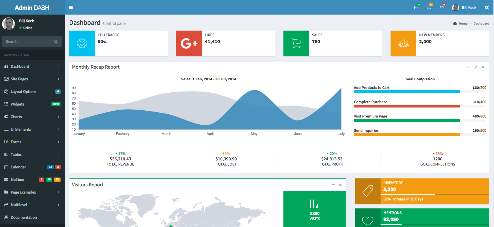

# Admin-Dash For Laravel 5.4

Admin-Dash is a start-up template implementing the [Admin LTE](https://almsaeedstudio.com/themes/AdminLTE/index2.html) admin panel into a Laravel 5.4 project.  The starter application is based on the sample application built in [Laravel 5.4 For Beginners](https://leanpub.com/laravel-5-4-for-beginners) by Bill Keck.

In addition to the Admin LTE implementation, Admin-Dash also includes Facebook and Github integration through Socialite.  Working datagrids, with pagination, column sorts and search, using Vue.js and various other features found in the [book](https://leanpub.com/laravel-5-4-for-beginners).

If you would like to help support the development of Admin-Dash, there is no donation button, however, contributions can be made by [purchasing the book](https://leanpub.com/laravel-5-4-for-beginners).

## Installation

Follow [the basic instructions](https://help.github.com/articles/fork-a-repo/) for forking a repo from Github.

You will have to create your own .env file for laravel.  You can get an example of a .env from the [master](https://github.com/laravel/laravel/blob/master/.env.example).  

You’ll note it has a blank APP_KEY.  You will need to run the following from the command line:

~~~~

php artisan key:generate

~~~~

You will also need to add your Github and Facebook .env parameters if you wish to use the social logins:

~~~~

FACEBOOK_ID=
FACEBOOK_SECRET=
FACEBOOK_URL=

GITHUB_ID=
GITHUB_SECRET=
GITHUB_URL=

~~~~

Obviously, you will have to create your Facebook and Github apps on your own to supply the credentials.  The starter app does support form-based login and registration, so you don’t need to have Facebook and Github setup for it to work.

You should also add your DB info in your .env file:

~~~~

DB_CONNECTION=mysql
DB_HOST=127.0.0.1
DB_PORT=3306
DB_DATABASE=your-db-name
DB_USERNAME=your-db-username
DB_PASSWORD=your-db-password

~~~~

After creating your DB and supplying the credentials, you will need to run from the command line:

~~~~

php  artisan migrate

~~~~

Next, from the command line,  run:

~~~~

npm install

~~~~

To navigate to the admin dashboard, create a user and change their is_admin value to 1 in the database.  This will cause the admin link to appear on the user dash.  Note that admin users are directed to the admin dash upon login.

To use this application, you need a working knowledge of the Laravel framework, with composer installed.  If you are unfamiliar with Laravel, see the [docs](https://laravel.com/docs/5.4).  For those just getting started, check out [Laravel 5.4 For Beginners](https://leanpub.com/laravel-5-4-for-beginners).

## License

Admin-Dash is open-sourced software licensed under the [MIT license](http://opensource.org/licenses/MIT).

